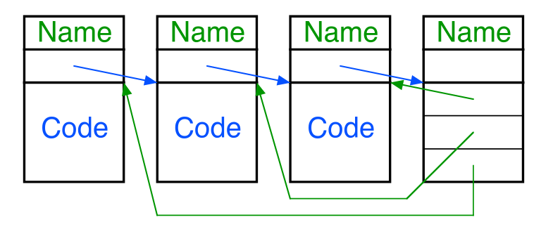
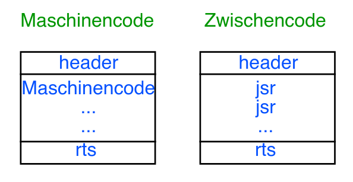
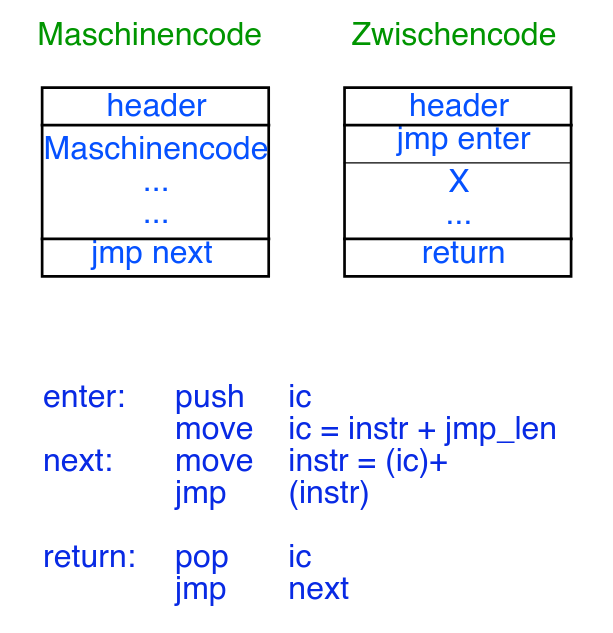

# Threaded Code

References:

- [ThreadedCode - Skriptum Slides](https://www.complang.tuwien.ac.at/andi/papers/ThreadedCode.pdf)
- [Threaded Code - Wikipedia](https://en.wikipedia.org/wiki/Threaded_code)

---

Aus dem Skriptum:

> Die interne Darstellung eines threaded Interpreters ist eine Liste von Adressen vorher definierter interner Darstellungen (Unterprogrammen). 
> Diese Darstellungen sind in einer linearen Liste aufgefädelt.
> Die einzelnen Elemente werden übersetzt.
> Die abstrakte Maschine ist meistens eine Stack-maschine.



Mit anderen Worten: Threaded Code besteht im Grunde aus zwei verschiedenen "Code"-Stücken:

- Zwischencode
- Maschinencode

Der Maschinencode ist der "tatsächliche" Code der ausgeführt wird. Das muss natürlich nicht klassisches (Dis-)assembly sein, sondern ein beliebiger Code der von einer gegebenen (abstrakten) Maschine ausgeführt werden kann.


Zwischencode ist lediglich für das managen des Maschinencodes zuständig. Auf Assembly-Ebene würde man hier zb eine Aneinanderreihung von jump instructions finden. Man kann sich das aber auch wie eine Main-Function vorstellen, die nacheinander function-calls macht.


Betrachtet man das Bild vom Skriptum, dann wären die ersten 3 Tabellen (mit `Code` geschrieben) die Maschinencode-Blöcke, und die 4te Tabelle enthält den Zwischencode-Block mit den Pointern zu den Maschinencode-Blöcken. Das wichtige Detail ist hier eben, dass die Maschinencode-Blöcke nichts voneinander wissen, sondern nur einen Pointer (`instruction counter` / `instruction pointer`) zurück auf den Zwischencode haben (genauer dann bei [Threaded Code Arten](#threaded-code-arten) beschrieben).


Es gibt jetzt aber mehrere Möglichkeiten, wie der Zwischencode und die "return logic" vom Maschinencode implementiert ist. Als simples Beispiel könnte der Zwischencode entweder wirklich eins nach dem anderen eine Funktion aufrufen, oder es gibt eine globale Liste mit einem index-counter welcher direkt nach jedem Function-Call sofort erhöht wird und somit kann die "return logic" vom Maschinen-Code selbst gleich den nächsten Maschinen-Code Block aufrufen.

Die Unterschiede hier geben dann je nach ISA und Microarch dann unterschiedlich gute performance.

Konkret unterscheiden wir zwischen diesen threaded code Arten:

- subroutine threaded code
- direct threaded code
- indirect threaded code
- token threaded code
- indirect token threaded code

## Threaded Code Arten
### subroutine threaded code
Die (meiner Meinung nach) einfachste Art von threaded code. Im Grunde genau die konkrete Abfolge von Function-Calls in einer main-function.

Auf Assembly-Ebene sieht das dann z. B. so aus:



Wie man sieht enthält der Zwischencode also wirklich subroutine calls, und der Maschinencode macht am Ende einfach ein return, wodurch der Zwischencode automatisch den nächsten subroutine call dann macht.

### direct threaded code



Beim direct threaded code springt man nicht mehr die ganze Zeit zwischen Maschinencode und Zwischencode hin und her. Der Zwischencode ist zwar noch immer der main entrypoint, aber enhält jetzt nur noch mehr eine Liste von Adressen / Pointern zu den einzelnen Maschinencode-Blöcken (also *keine* call instructions mehr).

Stattdessen wird jetzt am Anfang nur ein instruction-counter (ic) initialisiert (i.e. ein pointer zu der Address-Liste), welcher einfach am Anfang der Address-Liste beginnt. Nachdem der erste (oder ein beliebiger) Maschinencode-Block fertig ausgeführt wurde, steht am Ende von diesem ein `jmp next`. Schaut man sich im Bild den Pseudo-Assembly-Code an sieht man, dass hier einfach der `ic` incremented und dann auf die Addresse der nächsten instruction `instr` gesprungen wird `jmp (instr)`.

Das `push ic` und `pop ic` ist die exit-logic vom gesamten "Programm".

Hier auch ein Code-Beispiel von Wikipedia:

```c
#define PUSH(x) (*sp++ = (x))
#define POP() (*--sp)
start:
  ip = &thread  // ip points to &pushA (which points to the first instruction of pushA)
  jump *ip++  // send control to first instruction of pushA and advance ip to &pushB
thread:
  &pushA
  &pushB
  &add
  ...
pushA:
  PUSH(A)
  jump *ip++ // send control where ip says to (i.e. to pushB) and advance ip
pushB:
  PUSH(B)
  jump *ip++
add:
  result = POP() + POP()
  PUSH(result)
  jump *ip++
```

### indirect threaded code

Der Unterschied zwischen `direct` und `indirect` (unten dann auch bei `token`) threaded code ist, dass es eine weitere *Indirektion*, also ein extra Pointer gibt. Am besten vergleicht man den direct threaded code von oben mit den folgenden äquivalenten indirect threaded code:

```c
start:
  ip = &thread  // points to '&i_pushA'
  jump *(*ip)  // follow pointers to 1st instruction of 'push', DO NOT advance ip yet
thread:
  &i_pushA
  &i_pushB
  &i_add
  ...
i_pushA:
  &push
  &A
i_pushB:
  &push
  &B
i_add:
  &add
push:
  // look 1 past start of indirect block for operand address
  *sp++ = *(*ip + 1)  
  // advance ip in thread, jump through next indirect block to next subroutine
  jump *(*++ip)  
add:
  addend1 = *--sp
  addend2 = *--sp
  *sp++ = addend1 + addend2
  jump *(*++ip)
```

Man sieht, dass hier eine extra indirection ist (deswegen auch `jump *(*++ip)`, mit 2mal deref `*`).
Performance ist dadurch natürlich zwangsweise schlechter als bei direct threaded code, da schließlich eine pointer-deref mehr berechnet werden muss.

Der Vorteil ist allerdings ein kompakterer Code: Wenn beispielsweise `push` eine Implementation von 10 Zeilen hätte, dann würde das beim **direct** threaded code insgesamt **20** Zeilen hinzufügen (2 \* 10), bei **indirect** aber nur 10, da die Implementation "ausgelagert" wurde. Das funktioniert deswegen, da man jetzt Maschinencode selbst Parameter handeln kann, das sieht man z. B. bei `i_pushA`:

```c
i_pushA:
    &push
    &A
```

`&A` wird hier ausschließlich als Parameter für `push` verwendet. Da `&push` am Anfang von `i_pushA` steht, wird auch dorthin gesprungen: `*ip -> i_pushA, **ip -> *i_pushA -> push`. Bedeutet es wird nie (sinnvoller weise) auf die Adresse von `A` gesprungen, sondern nur in der Implementation von `push` dann selbst dereferenziert und als **Wert** (in dem Fall für den Stack) verwendet:

```c
push:
    *sp++ = *(*ip + 1)
```

`*ip + 1 -> i_pushA + 1 -> &A, *(*ip + 1) -> *(i_pushA + 1) -> *(&A) -> A`

### token threaded code
Im Grunde noch eine zweite Art von indirection. Jetzt geht es im Grunde um folgenden Fall:

```c
thread:
    &pushA
    &pushA
    &add
```

In diesem Code wurde 2mal `pushA` referenziert. Ein Pointer hat natürlich selbst auch eine gewisse Größe (z. B. 8byte für 64-Bit Systeme). Wir verbrauchen also in dem code-snippet oben insgesamt `3 * 8 = 3byte` (zur runtime). ***DAS IST VIEL ZU VIEL OMG***

Als Lösung für dieses tragische Problem kann man also nun eine extra Tabelle erstellen, welche einfach alle Adressen aller verwendeten Funktionen auflistet. Greift man nun auf diese Tabelle per "index" zu, kann man sich demnach Platz sparen, jenachdem wie groß der Datentyp für den Index ist.

Bsp: Index hat 1bit Größe (i.e. 2 Einträge in der Tabelle möglich)

```c
thread:
    1
    1
    0

table:
    &add
    &pushA
```

Hiermit verbrauchen wir also nur noch mehr `(2 * 8) + (3 * 1) = 19bit < 3 byte`. Eine unfassbare `~20%` runtime code-size reduction.

Der Rest bleibt im Grunde gleich, ein vollständiges Bsp wäre:

```c
start:
  vpc = &thread
dispatch:
  // Convert the next bytecode operation 
  // to a pointer to machine code that implements it
  addr = decode(&vpc) 
  // Any inter-instruction operations are performed here 
  // (e.g. updating global state, event processing, etc)
  jump addr
CODE_PTR decode(BYTE_CODE **p) {
  // In a more complex encoding, 
  // there may be multiple tables to choose between or control/mode flags
  return table[*(*p)++];
}
thread:  /* Contains bytecode, not machine addresses.  Hence it is more compact. */
  1 /*pushA*/
  2 /*pushB*/
  0 /*add*/
table:
  &add    /* table[0] = address of machine code that implements bytecode 0 */
  &pushA  /* table[1] ... */
  &pushB  /* table[2] ... */
pushA:
  *sp++ = A
  jump dispatch
pushB:
  *sp++ = B
  jump dispatch
add:
  addend1 = *--sp
  addend2 = *--sp
  *sp++ = addend1 + addend2
  jump dispatch
```

Wir haben also noch immer einen instruction pointer, allerdings zeigt dieser jetzt nicht mehr auf "echte" Adressen, sondern auf Indexe `->` und diese können wir gemeinsam mit der Tabelle verwenden um dann doch den Pointer vom Maschinencode zu bekommen.

### indirect token threaded code

Einfach eine Kombination aus token threaded code und der vorherigen Beschreibung von `indirect` threaded code.

- `token` `->` Reduziert size beim referenzieren im call-thread
- `indirect` `->` Reduziert size indem Maschinencode nicht (weniger) dupliziert werden muss


## Threaded Code Vergleich
Äquivalenter Code kann auf die verschiedenen threading Arten compiled werden.
Allerdings macht es ja einen Unterschied auf welcher MiA ein Code ausgeführt wird.
Diese Unterschiede in der MiA können dann sogar dazu führen, dass derselbe Code mit zb:

- `direct threaded` **schneller** als `subroutine threaded` auf Maschine `A` ist, aber
- `direct threaded` **langsamer** als `subroutine threaded` auf Maschine `B` ist

Man kann daher nicht per-se sagen, welche Threading-Art schneller ist (mit Außname, dass indirect natürlich immer langsamer als direct threading ist).

TODO: Brauchen wir hier genauer die Beispiele aus den Folien mit den konkreten CPUs wissen?
