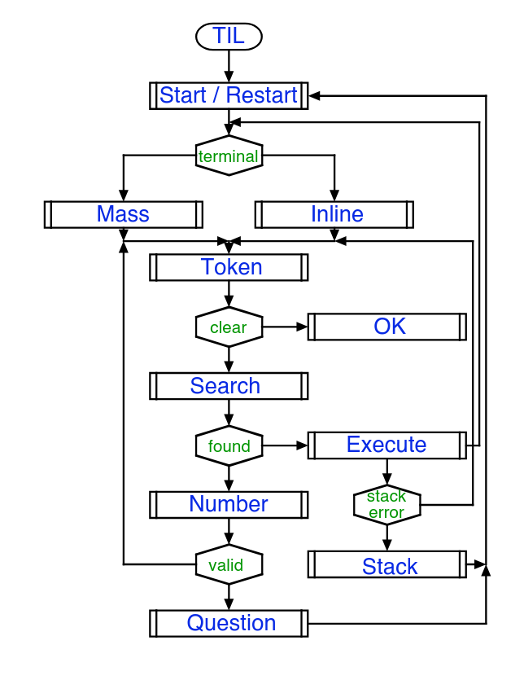
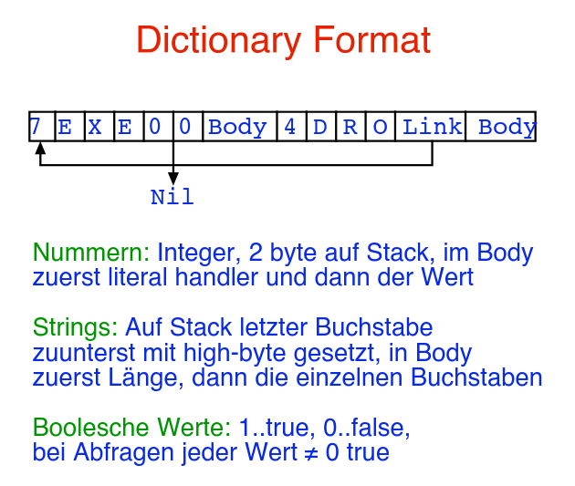

# Forth - ZIP

ZIP (Z80 Interpretative Processor) ist eine FORTH-artige Sprache die hier als Referenz genommen wird.

## Merkmale
- Indirect threaded code
- stack orientiert
- "funccalls" sind 3 zeichen lang
- 4kb memory
- integer arithmetik
- loop-anweisungen (kein goto)
- einfacher line editor ("REPL")

## Interpreter Aufbau

### Start/Restart
initialisiert Stack pointer, System Variable und Execute-Modus

### Mass/Inline
liest eine Zeile in Zeilenbuffer

### Token
liest den nächsten token aus dem Zeilenbuffer und stellt ihn in Dictionary

### Ok
gibt eine Ok-Meldung aus

### Search
sucht token im dictionary und gibt Adresse + `gefunden` Flag auf den Stack

### Execute
Falls compile-mode und kein `immediate` command $\to$ compilen
Sonst (immediate command oder execute-Mode) $\to$ sofort ausführen

### Stack
gibt Fehlermeldung aus (falls stack-error) und geht danach zum start

### Number
stellt Nummer auf Stack oder übersetzt sie

### Question
gibt token und Fehlermeldung (gutes altes `?`) aus

## Dictionary

Eine lineare Liste an characters. Jeder Eintrag hat dabei eine bestimmte Reihenfolge:

1. Eine Zahl: Indicated die Länge vom Namen
2. Eine Kette an characters: Name des Commmands
3. Ein `Link`: Pointed auf den vorherigen Eintrag (wird zum Suchen verwendet), erster Eintrag hat entsprechend einen nil-pointer.
4. Einen Body (`code-pointer`): Ein Pointer zu einer Adresse, wo der actual code für die Variable/Konstante abgelegt ist. Wird auch `run-time code` genannt, da im Grunde genau dieser Code bei der Verwendung der Variable/Konstante ausgeführt wird.

Note: Die Länge (1.) des Namens und der Name-Entry (2.) passen nicht zusammen, da immer nur die ersten 3 characters des "Befehls" gespeichert werden, das bedeutet vor allem, dass sich jeder (gleich lange?) Name in den ersten 3 characters unique sein muss!

## Syntax
### Konstanten und Variablen

- Konstante: `DECIMAL 255 CONSTANT max`

    - Bei Verwendung: Direkter Wert am Stack

- Variable: `DECIMAL 127 VARIABLE foo`

    - Bei Verwendung: Adresse am Stack

### Arrays
Lege eine Variable wie immer an und erhöhe aber den Dictionary-Pointer `DP` um eine `size`.

### Users
Beliebiger "User-Space" speicher ("heap")

## Systemparameter
Vordefinierte Variablen dessen Wert über den Interpreter gesetzt werden, z. B. `DP` oder `MODE` (gibt an ob Execute/Compile mode)

## Stackbefehle
Vordefinierte Befehle zum interagieren mit dem Stack

- DROP
- DUP
- SWAP
- `@` (dereferenziert top of stack)
- `RROT, LROT` (rotiert top 3 element vom stack)
- ...

## Rechenbefehle

- ABS
- MINUS
- `+`
- `-`
- MAX
- MIN
- ...

## Kontrollstrukturen

- `flag IF ... ELSE ... THEN ...`
    
    - `flag` ist die condition (deklariert als Variable)
    - Falls true -> `IF` block ausführen
    - Falls false -> `ELSE` block ausführen
    - Anschließend `THEN` block ausführen

- `BEGIN ... END` Loops (`BEGIN ... flag END`)
- `BEGIN ... flag IF WHILE`
- ...
- `LEAVE` "break" für `DO`-Loops
- `switch` mit Sprungtabelle implementieren

## Compiling Keywords

- `CREATE`: stellt den nächsten token ins dictionary
- `::`: startet compilemode, macht ein create und setzt die Adresse von `enter` ins dictionary
- `;:`: setzt Adresse von `return` ins dictionary und beendet compilermode
- `;CODE` setzt Adresse von `SCODE` (?) in dictionary und beendet compilermode
