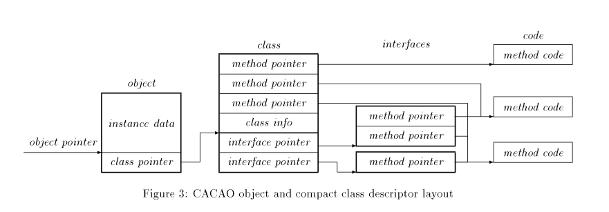
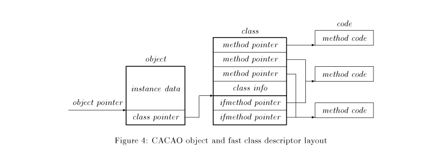

# JVM

## JVM Architecture

### Datatypes

Basic Datatypes: `byte` (1 byte), `short` (2 byte), `int` (4 byte), `long` (8 byte),  `float` (4 byte), `double` (8 byte), `char` (2 byte unicode)
Auch: `object` (4 byte reference), `returnAddress` (4 byte); Arrays = object

### Registers

32bit wide

PC: address of the next bytecode to execute

Für jede Methode:

- `vars` register referenziert set von local variables
- `optop` pointed auf operand stack
- `frame` pointed auf execution environment structure (stack frame)

### Lokale Vars

Alle lokalen Vars nehmen 32bit ein

- Problem: `long` und `double` sind 8byte = 64bit
- Lösung: `long` und `double` Variablen nehmen 2 Variablen "slots" (hintereinander) ein und werden über den ersten referenziert

### Operand stack

32bit wide

Funktioniert wie überall sonst auch, Werte werden bei einer operation popped, pushed, etc...

Der Byte-Code ist über den "bytecode verifier" typed, wenn also bei `ladd` (long add) zwei ints plötzlich kommen, dann ist das illegal.

### Execution Environment

Für dynamic linking, normal method returns und exception propagation

#### Dynamic Linking
Handled method calls welche in verschiedenen environmenten existieren, z.B.: Methode von anderer Klasse wird aufgerufen $\to$ statische Variablen dieser Klasse in Kontext holen.

#### Normal Method Returns
Wie der Name beschreibt: Kümmert sich um das return aus einer Methode und returned den entsprechenden Value an den caller und lädt wieder das environment vom Caller mit PC angepasst an die nächste "Zeile".

#### Exception Propagation
Beschreibt einfach, dass exceptions existieren und gethrown bzw. gecatched werden können.

### Garbage Collected Heap
Java is garbage collected: Objekte am heap werden automatisch deallokiert und können nicht händisch deallokiert werden.

### Method Area
Ein Bereich in memory wo der actual compiled java code und symbol tables stehen.

### Java Instruction Set

- 1byte opcode
- Variable Anzahl an Operanden (0:n)
- Anzahl der Operanden über Opcode nachschauen


## Class File Format

### Format

```c
ClassFile {
    u4 magic;

    u2 minor_version;
    u2 major_version;

    u2 constant_pool_count;
    cp_info constant_pool[constant_pool_count - 1];

    u2 access_flags;

    u2 this_class;
    u2 super_class;

    u2 interfaces_count;
    u2 interfaces[interfaces_count];

    u2 fields_count;
    field_info fields[fields_count];

    u2 methods_count;
    method_info methods[methods_count]

    u2 attributes_count;
    attribute_info attributes[attribute_count];
}
```

#### `magic`
must be `0xCAFEBABE` lmaaooo


#### `minor_version`, `major_version`
Versionen vom Java-Compiler der das Class-File erstellt hat

#### Constant Pool
String constants, class names, field names, ...

#### Access Flags
Visibility modifiers: public, private, protected, static, final, synchronized, ...

#### `this_class`, `super_class`
Indicies in den `constant_pool`

#### Interfaces
Jeder Wert ist hier auch ein Index in `constant_pool`

#### Fields

```c
field_info {
    u2 access_flags;
    u2 name_index;
    u2 signature_index;
    u2 attributes_count;
    attribute_info attributes[attribute_count];
}
```


Wobei `access_flags` schon bekannt ist, `name_index` ein Index im `constant_pool` und `signature_index` ein Index im `constant_pool` für den Type ist.

#### Methods
```c
method_info {
    u2 access_flags;
    u2 name_index;
    u2 signature_index;
    u2 attributes_count;
    attribute_info attributes[attribute_count];
}
```

Wie man sieht, ident zu `field_info`.

#### Attributes

Zusätzliche Infos für den class file reader - muss nicht verwendet werden und Attribute, die der Compiler nicht versteht sollen auch geskipped werden.

```c
GenericAttribute_info {
    u2 attribute_name;
    u4 attribute_length;
    u1 info[attribute_length];
}
```

z. B.: SourceFile, ConstantValue, Code, ExceptionsTable, LineNumberTable, ...

Wie gesagt ist das alles nur Zusatzinfo für den class file reader und wirkt sich nicht auf die actual execution aus.

### Signatures

Ein String der den Typ für eine Methode, Field oder Array enthält.
Hat ein bestimmtes Format, aber eigentlich unwichtig.


## The Virtual Machine Instruction Set

Einfach eine Liste von den instructions die Verfügbar sind. Wie gesagt indicated durch den opcode und enthält 0 bis `n` Operanden. 
Damit wird dann am Stack gearbeitet.


## CACAO

CACAO ist eine JVM-Implementation, die nur einen JIT (keinen Interpreter) hat und den Java-Bytecode vor der Ausführung in eine registerbasierte IR übersetzt. Es benutzt den Hans Boehm GC.

### JIT
Methoden werden beim ersten Method-Call, on-demand, zu native-code kompiliert.

### Register IR
Der Übersetzungsalgorithms ist einfach (z.b. `a = b * c + d`):
1. Jedem Stack Element ein Pseudo-Register zuweisen
```
iload b   # move b, t0
iload c   # move c, t1
imul      # OP2(IMUL) t0, t1, t2
iload d   # move d, t3
iadd      # OP2(IADD) t2, t3, t4
istore a  # move t4, a
```

2. Mit Copy-Propagation so viele `move`s eleminieren wie möglich

```
OP2(IMUL) b, c, t2
OP2(IADD) t2, d, a
```

### Klassenrepresentation
Alt (so it's in den Folien):


Neu (eine Indirection weniger):


### Registerbelegung
- Muss schnell sein, Graph Coloring zu langsam
- CACAO lässt sich helfen durch die Tatsache, dass die JVM bereits einige Optimierungen auf dem Bytecode macht
- Algorithmus:
    1. Argumente bekommen CPU-Register zugeteilt
    2. Müssen gewisse Register in bestimmten CPU-Registern landen (z.B. um unnötige `move`s vor `call`s zu verhindern) werden diese Register auch zugeteilt (pre-colored)
    3. Gehe jede Instruktion durch:
        1. Wenn ein CACAO-Register aktiviert wird, was kein CPU-Register zugeteilt hat, teile eines zu
        2. Wenn keine freien CPU-Register übrig sind, sind, spill das Register in den RAM

### Exception Handling
- **Runtime Checks** (z.B. Bound Checks, Null-Checks, ...) werden in den Code eingesetzt
- Diese Checks können in vielen Fällen wegoptimiert werden
- Diese Checks setzen ein **Exception Register** wenn eine Exception auftritt
- Nach jedem Method Call wird dieses Exception Register überprüft und der Exception-Handling-Code aufgerufen
- Das ist eine Branch-Instruction und wird von Branch predictoren meist **sehr gut optimiert**

### Warum es schnell ist
- **Register IR**
- **JIT Compilation**
- **Gute & Schnelle Registerbelegung**
- **Effizientere Object & Klassenrepresentation**
- Effiziente Synchornization
    * (Steht in den Folien, Paper geht nicht drauf ein)
- Schnelles Exception handling
    * (oben näher eingegangen)
- Schelle Runtime-Checks
    * werden als Checks in einer Bitmatrix implementiert, das Paper geht nicht näher drauf ein

> Mythos: JVM startet langsam wegen JIT.
> Eigentlich: Das laden der Klassen dauert einfach *****-lange