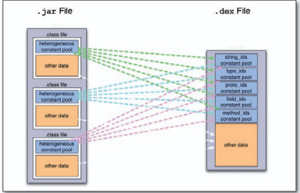
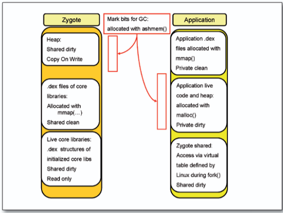

# DalvikVM

## Android Boot-Prozess

1. Start `init.rc`: Startet Systemdienste
2. Service Manager und Zygote start: Zygot lässt Android-Anwendungen als Linux-Prozesse laufen (`fork()`), 
3. Service Manager bietet API für Android-Anwendungen an Systemdienste

## DVM

Android Programme laufen auf der DVM - DalvikVM, die zwei grundlegenden Unterscheidungen zw. der DVM und JVM sind dabei:

1. Die DVM ist eine Registermaschine (JVM ist eine Stackmaschine)
2. Die Länge der opcodes der DVM ist zwei byte (JVM nur ein byte)

Da die DVM davon "ausgeht", dass sie auf ARM-Prozessoren laufen wird, nutzt sie entsprechend folgenden Vorteil aus: Da wir eine Registermaschine haben und in Java Methoden nur extrem selten mehr als 16 Argumente + Parameter haben, können bei einem Methodenaufruf die 16 (echten) Register eines ARM Prozessors 1:1 genutzt werden.

## Dalvik Executable Format (.dex)

Ein großer Vorteil von `.dex` Dateien gegenüber `.jar`s ist dabei:

- in Java hat jede `.class` file einen eigenen `heterogeneous constant pool` - also z.B. pool von strings von Klassennamen
- Diese pools zwischen den `.class` files können damit mehrfach denselben entry haben
- Daher: In `.dex` Files gibt es nur einen einzigen `string_ids` constant pool wo potentiell duplizierte Eintrage dedupliziert werden.
- Daher: `.dex` files sind im Durchschnitt um 35% kleiner als `.jar` files!

Das lässt sich auch in der folgenden Grafik sehen:

### DEX Optimierungen

Ein paar Optimierungen, welche durch das `dexopt` Programm auf eine `.dex` Datei angewendet werden können, sind z. B.:

- 16bit Alignment (einführen von `nop`s wenn notwendig)
- pruning von leeren methoden
- method inlining
- virtueller Methodenaufruf mit `invoke-virtual*` durch `invoke-quick` ersetzen
- Daten (zb Hashwerte) zu "compile-time" (optimierungs-time) vorberechnen

## Shared Memory

4 Kategorien:

- **Shared clean**: Shared = allen Prozessen zugänglich (global), clean = mit `mmap` erstellter und gelöschter Speicher
- **Shared dirty**: dirty = Speicher via `malloc` und `free`
- **Private clean**: private = prozessspezifisch
- **Private dirty**: Prozessspezifisch und mit `malloc` + `free` (Heap-Data pro prozess)

DVM (bzw. der manager Zygote) nutzt diese Kategorien wie folgt aus:

- Möglichst viele nützliche Java-Klassen in einen **shared dirty** state bringen, damit mehrere Apps diese global nutzen können, ohne selbst damit mehrmals dieselben Klassen jeweils lokal nochmal zu laden.
- Es werden konkret zwei **shared dirty** Bereiche erstellt

    - einen read-only Bereich für die DEX-Strukturen (pools)
    - einen heap-bereich wo die Instanzen dieser Klassen abgelegt werden, damit diese über mehrere Apps shared genutzt werden können.
        
        - hierbei gilt copy-on-write, sonst würde eine mutation der Instanz in einer App ja alle anderen blöderweise beeinflussen.
        - es wird bei einem copy dann eben in einen private-dirty Bereich kopiert.

- Weiters wird noch ein dritter Bereich, diesmal **shared clean** erstellt:

    - dieser enthält alle core-libs von `core.jar`
    - wenn eine App darauf referenziert werden entsprechend beide vorher genannten **shared dirty** Bereiche erweitert

Hier noch eine Skizze dazu:

## GC

Die DVM ist natürlich garbage collected, wobei der Dalvik GC ein Mark-and-Sweep Verfahren benutzt.
Das heißt, dass es zu jedem heap-allocated Objekt ein Markierungsbit braucht, welches anzeigt ob das Objekt noch alive ist.

Da Zygote aber hier die komplexere shared memory Struktur aufbaut, sollte auch entsprechend der GC ein Wissen darüber haben.
Im Prinzip werden die Bits also zentral in einer eigenen Memory-Region verwaltet und jene Objekte, die von Apps selbst (private) erstellt werden, werden fürs `free`n bevorzugt (gegenüber den shared Objekten - da diese mit hoher/höherer Wahrscheinlichkeit wiederverwendet werden).
