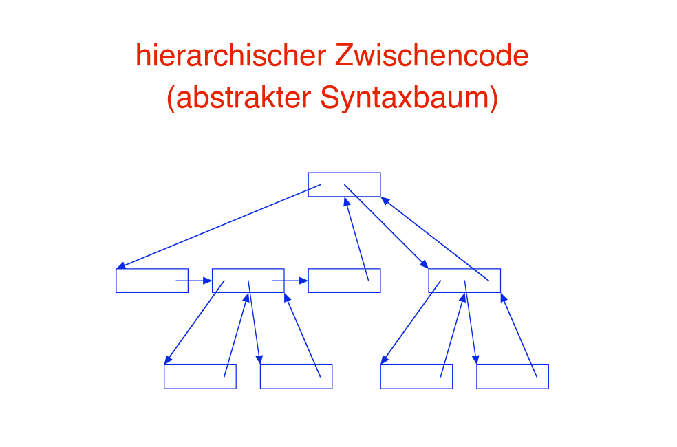

# Syntaxgesteuerte Editoren

Texteingaben via templates:

```
PROGRAM <name> (<namelist>);
    <declaration>
BEGIN
    <variable> := <expression>
END.
```

## Anforderungen an den Zwischencode

- bijektive Abbildung zwischen Quellprogramm und Zwischencode
- speichereffizient
- laufzeiteffizient
- Rückwertsausführung muss möglich sein $\to$ jeder Befehl muss einen inversen Befehl haben
- Semantik leicht erkennbar
- einfaches Einfügen und Löschen von Code

Der Zwischencode ist selbst ein AST $\to$ folgt aus der Anforderung der bijektiven Abbildung zw. Quellprogramm und Zwischencode

Daraus ergeben sich folgende Besonderheiten:

- Jede Node hat einen (oder mehrere) Pointer welcher auf einen nächsten (gleichrangigen oder child) oder auf eine Parent-Node (exit) zeigt.
- Eine `if-then-else` Node hätte damit zb einen Pointer zur `then` Node, einen zur `else` Node und einen zur generell nächsten (potentiell Parent-)Node
- Offsetfeld gibt an, wo sich die Node im Kontext des parents befindet
- Vorgänger-Node wird über Parent-Node erreicht (i.e. offset ist bekannt $\to$ jump to parent und geh zu child mit `offset - 1`)
- Pointer können Sprungbefehle sein; Feld vor dem Sprungziel enthält dann den Offset zum Node-Start


