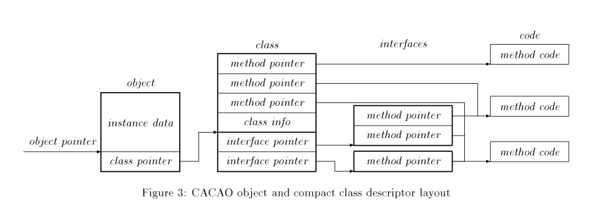
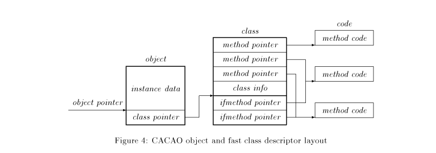

# CACAO JVM

CACAO ist eine JVM-Implementation, die nur einen JIT (keinen Interpreter) hat und den Java-Bytecode vor der Ausführung in eine registerbasierte IR übersetzt. Es benutzt den Hans Boehm GC.

## JIT
Methoden werden beim ersten Method-Call, on-demand, zu native-code kompiliert.

## Register IR
Der Übersetzungsalgorithms ist einfach (z.b. `a = b * c + d`):
1. Jedem Stack Element ein Pseudo-Register zuweisen
```
iload b   # move b, t0
iload c   # move c, t1
imul      # OP2(IMUL) t0, t1, t2
iload d   # move d, t3
iadd      # OP2(IADD) t2, t3, t4
istore a  # move t4, a
```

2. Mit Copy-Propagation so viele `move`s eleminieren wie möglich

```
OP2(IMUL) b, c, t2
OP2(IADD) t2, d, a
```

## Klassenrepresentation
Alt (so it's in den Folien):


Neu (eine Indirection weniger):


## Registerbelegung
- Muss schnell sein, Graph Coloring zu langsam
- CACAO lässt sich helfen durch die Tatsache, dass die JVM bereits einige Optimierungen auf dem Bytecode macht
- Algorithmus:
    1. Argumente bekommen CPU-Register zugeteilt
    2. Müssen gewisse Register in bestimmten CPU-Registern landen (z.B. um unnötige `move`s vor `call`s zu verhindern) werden diese Register auch zugeteilt (pre-colored)
    3. Gehe jede Instruktion durch:
        1. Wenn ein CACAO-Register aktiviert wird, was kein CPU-Register zugeteilt hat, teile eines zu
        2. Wenn keine freien CPU-Register übrig sind, sind, spill das Register in den RAM

## Exception Handling
- **Runtime Checks** (z.B. Bound Checks, Null-Checks, ...) werden in den Code eingesetzt
- Diese Checks können in vielen Fällen wegoptimiert werden
- Diese Checks setzen ein **Exception Register** wenn eine Exception auftritt
- Nach jedem Method Call wird dieses Exception Register überprüft und der Exception-Handling-Code aufgerufen
- Das ist eine Branch-Instruction und wird von Branch predictoren meist **sehr gut optimiert**

## Warum es schnell ist
- **Register IR**
- **JIT Compilation**
- **Gute & Schnelle Registerbelegung**
- **Effizientere Object & Klassenrepresentation**
- Effiziente Synchornization
    * (Steht in den Folien, Paper geht nicht drauf ein)
- Schnelles Exception handling
    * (oben näher eingegangen)
- Schelle Runtime-Checks
    * werden als Checks in einer Bitmatrix implementiert, das Paper geht nicht näher drauf ein

> Mythos: JVM startet langsam wegen JIT.
> Eigentlich: Das laden der Klassen dauert einfach *****-lange